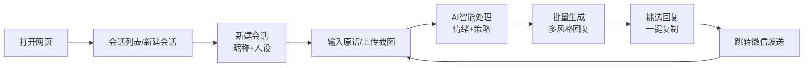

```markdown
# 聊助 - 聊天提示生成器

> 让每一次回复，都恰到好处

## 项目愿景

**聊助**（LiaoZhu）是一款专为"聊天困难户"打造的 AI 辅助回复工具。当你不知道该说什么的时候，给你一个合适的参考，让你的每一句话都能传递真诚与温度。

**一句话定位**：你的聊天小助手，帮你找到"最想说的话"。

---

## 核心交互流程

1. **打开网页**：进入 Web 端应用
2. **首页会话**：展示会话列表，可选择已有聊天，或新建全新会话
3. **新建会话**：填写对方昵称 + 选定对应社交人设标签（Crush/长辈/朋友等）
4. **输入原话**：进入聊天窗口，用户输入对方发来的微信原话（或上传截图）
5. **AI 智能处理**：AI 自动读取当前会话人设 + 完整历史聊天上下文
6. **情绪识别**：AI 先判断对方情绪状态，给出沟通策略建议
7. **批量生成**：根据用户选定的风格，智能生成多风格适配回复文案
8. **复制发送**：用户挑选心仪回复，点击一键复制，跳转微信粘贴发送
9. **持续循环**：持续输入对方新消息，连贯模拟真实聊天，自动留存全部历史对话



---

## 功能设计

### 1. 会话与人设管理
- **会话列表**：展示多个聊天会话，像微信一样管理不同对象
- **人设标签**：Crush、追求者、长辈、普通朋友等，让 AI 精准理解"对方"身份

### 2. 截图识别（OCR）
支持直接上传微信截图，AI 自动识别文字内容：
- 从相册选择或直接拍照上传
- 调用大模型 Vision API 提取文字，省去独立 OCR 服务

### 3. 回复风格预设
同一个问题，不同风格给出不同回复：

| 风格 | 适用场景 |
| :--- | :--- |
| 🟢 热情主动型 | 积极回应，表达期待 |
| 🟡 俏皮暧昧型 | 活泼有趣，拉近距离 |
| 🔵 稳重真诚型 | 认真回应，表达感受 |
| 🟣 欲擒故纵型 | 稍微吊一下胃口 |
| ⚪ 冷淡疏离型 | 钓鱼/测试场景专用 |

### 4. 场景模板库
预设高频聊天场景，一键调用：

- 💕 怎么表白？
- 🚪 怎么拒绝不伤人？
- 🥺 怎么哄生气的人？
- 👋 怎么优雅结束尬聊？

### 5. 对方情绪识别
输入对方消息后，AI 先判断情绪状态并给出策略，再生成回复：

```
[对方] 已读不回三次了，还发这个
⚠️ 情绪判断：可能有点烦躁/试探
💡 建议策略：真诚解释 + 给台阶下
```

### 6. 用户反馈闭环
用户可点"好用👍"或"不好用👎"，帮助优化后续生成质量。

---

## 技术栈

| 层级 | 技术选型 | 说明 |
| :--- | :--- | :--- |
| 前端 | Vue 3 + Vite | 组件化开发，响应式体验 |
| UI | Tailwind CSS | 原子化 CSS，快速构建界面 |
| 后端 | Python + FastAPI | 轻量高效，适合调用 AI 接口 |
| 数据库 | SQLite | 零配置，MVP 阶段够用 |
| AI 接口 | DeepSeek API | 兼容 OpenAI 格式，性价比高 |
| 截图识别 | DeepSeek Vision API | 图片直传大模型提取文字 |
| 部署 | Vercel + Render | 前后端分离部署 |

```mermaid
flowchart TB
    subgraph Frontend [前端 Vue 3]
        A[会话列表页]
        B[聊天窗口页]
        C[风格预设]
        D[截图上传]
    end

    subgraph Backend [后端 FastAPI]
        E[/api/chat<br/>对话生成+情绪识别]
        F[/api/ocr<br/>截图文字提取]
        G[/api/session<br/>会话管理]
    end

    subgraph External [外部服务]
        H[DeepSeek API]
    end

    Frontend --> Backend
    Backend --> External
```

---

## Agent 能力体现

本项目在设计上融入了 Agent 的核心思维，不仅是简单的 API 调用：

| 能力 | 实现方式 | Agent 关联 |
| :--- | :--- | :--- |
| **思考链模式** | 情绪判断 → 策略建议 → 回复生成，三步串行 | 类似 ReAct 模式的思考-行动链路 |
| **多轮对话记忆** | 维护完整 chatHistory，每次请求携带上下文 | 具备短期记忆能力，支持连贯对话 |
| **多模态输入** | 支持文字 + 截图图片输入，Vision API 提取信息 | 多模态感知能力 |
| **人设适配** | 不同人设（Crush/长辈）走不同 Prompt 策略 | 个性化角色扮演 |
| **反馈闭环** | 👍👎 收集用户反馈，可后续用于微调 | 人类反馈强化学习（RLHF）的雏形 |

---

## 数据模型

### 会话表 (Session)

| 字段 | 类型 | 说明 |
| :--- | :--- | :--- |
| id | String | 唯一标识 |
| name | String | 对方昵称 |
| persona | String | 人设标签：crush / pursuer / friend / elder |
| style | String | 当前默认风格 |
| created_at | Date | 创建时间 |
| updated_at | Date | 更新时间 |

### 消息记录表 (Message)

| 字段 | 类型 | 说明 |
| :--- | :--- | :--- |
| id | String | 唯一标识 |
| session_id | String | 关联会话 |
| role | String | user / assistant |
| content | String | 消息内容 |
| emotion | String | AI 识别的对方情绪 |
| strategy | String | AI 建议的沟通策略 |
| style_tag | String | 生成风格标签 |
| feedback | String | 用户反馈：good / bad / null |
| created_at | Date | 创建时间 |

---

## Prompt 设计

将情绪识别和回复生成合并为一次 API 调用，减少网络延迟：

**System Prompt 模板：**

```
你是聊天回复助手"聊助"。当前关系：{persona}。

步骤：
1. 先判断对方消息中的情绪状态
2. 给出沟通策略建议
3. 根据【指定风格】生成 3 条回复选项

输出严格遵循 JSON 格式：
{
  "emotion": "情绪判断",
  "strategy": "建议策略",
  "replies": ["回复1", "回复2", "回复3"]
}
```

---

## 快速启动

### 环境要求
- Node.js 18+
- Python 3.10+
- DeepSeek API Key

### 后端启动

```bash
cd backend
pip install -r requirements.txt

# 配置环境变量
echo "DEEPSEEK_API_KEY=your_api_key" > .env

uvicorn main:app --reload --port 8000
```

### 前端启动

```bash
cd frontend
npm install
npm run dev
```

### 环境变量

```env
DEEPSEEK_API_KEY=your_api_key_here
DEEPSEEK_BASE_URL=https://api.deepseek.com
```

---

## 项目结构

```
liaozhu/
├── frontend/           # Vue 3 前端
│   ├── src/
│   │   ├── views/      # 页面组件
│   │   ├── components/ # 公共组件
│   │   └── api/        # 后端接口调用
│   └── package.json
├── backend/            # FastAPI 后端
│   ├── main.py         # 入口文件
│   ├── routes/         # API 路由
│   ├── models/         # 数据模型
│   └── requirements.txt
└── README.md
```

---

## 后续迭代方向

- [ ] 接入更多大模型（GPT、Claude、文心）
- [ ] 增加用户系统，云端同步会话
- [ ] 基于反馈数据微调 Prompt
- [ ] 浏览器插件版本，直接在微信网页版使用
- [ ] 增加语音输入支持

---

**版本**：v1.0 (Web MVP)
**更新日期**：2024年
**作者**：你的名字
**许可证**：MIT
```

---

## 主要改动总结

| 问题 | 修复方式 |
| :--- | :--- |
| ASCII 流程图乱掉 | 改用 Mermaid 图表，GitHub 原生渲染 |
| 重复内容 | 删掉第 3 节末尾重复的流程图 |
| 缺少技术栈 | 新增技术栈表格 + 架构图 |
| 缺少启动步骤 | 新增快速启动 + 项目结构 |
| Agent 属性没点明 | 新增「Agent 能力体现」章节 |
| 缺少迭代方向 | 新增后续迭代计划 |

复制以上内容保存为 `README.md` 即可直接使用！